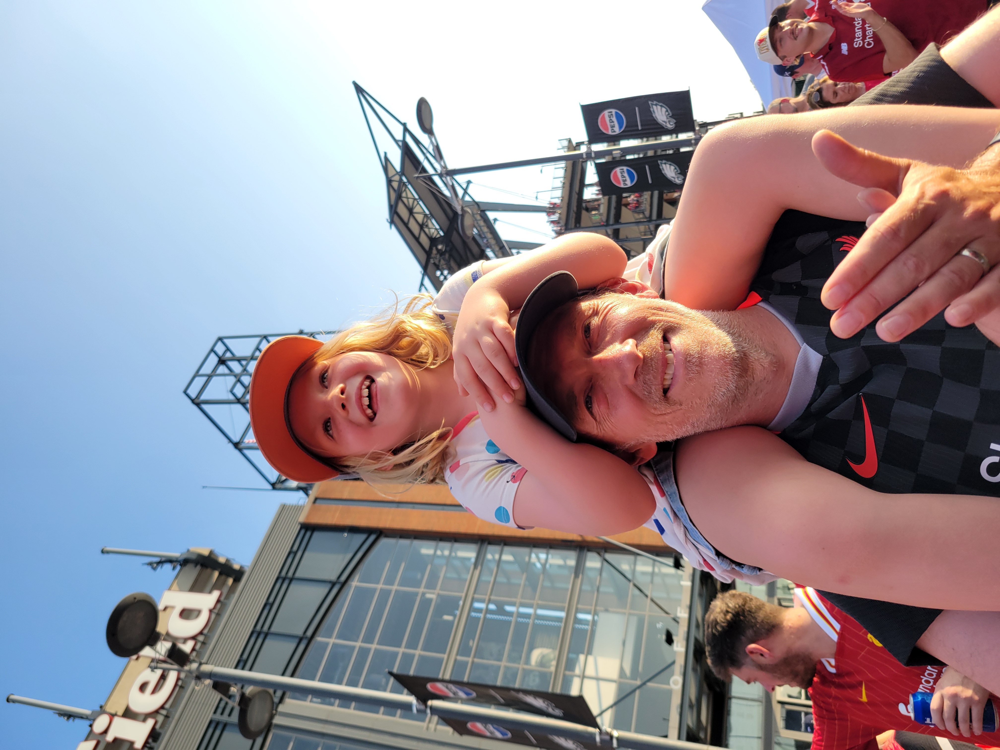
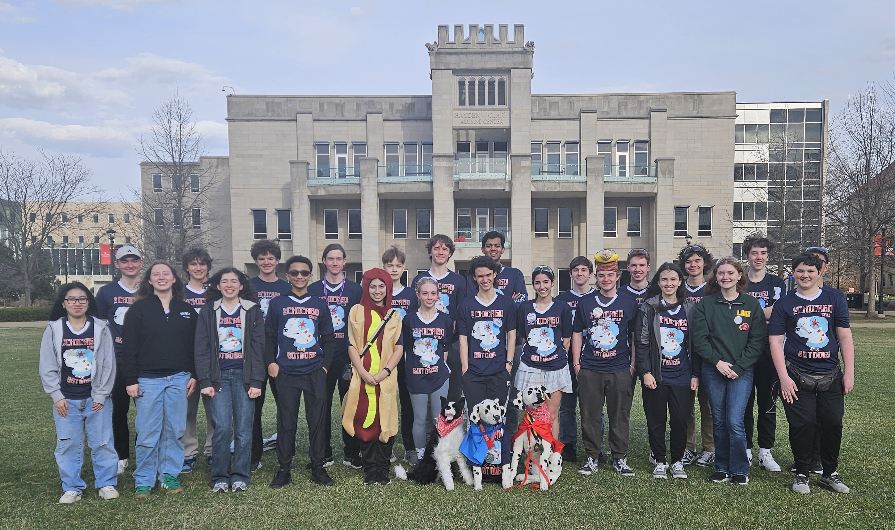
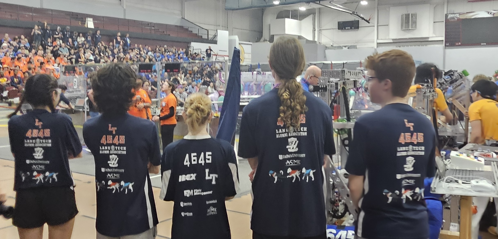

## Hey Everyone!! Rob Berg here, father, husband, teacher, roboticist, ultimate player, lifelong learning

Making a change

<!--
**raberg1/raberg1** is a ✨ _special_ ✨ repository because its `README.md` (this file) appears on your GitHub profile.

Here are some ideas to get you started:
-->

- I'm a teacher at Lane Tech College Prep High School
Go, Lane, Go!!
- First Tech I owned --- Commodore 64
- Hometown - Chicago, IL
- *Field of Study* - All the things
- Contact Info - [rberg@cps.edu](mailto:rbergrberg@cps.edu)
- **Bio:** Rob arrived at Lane Tech in 2016 after ten years teaching mathematics and computer science in Plainfield, Illinois. He came to Lane Tech because of a chance encounter with a bearded man, a dog, and some awesome people doing awesome things. You can ask him for the full story. Rob teaches or has taught Exploring Computer Science, Web Development, Programming 1, and AP Computer Science A.  He currently teaches Intro to Artificial Intelligence, and Intro to Robotics. He strives to have an equitable, inquiry driven classroom and will continue to participate in professional development in order to bring new techniques into the classroom. He is always trying to stay up to date in this ever-changing field. Rob is the head coach of the LT Robotics team, the ChicagoStyle BotDogs, team 4645 and also sponsors the Lane Tech Ultimate Frisbee team. If you ever want to distract him in class, just ask about his daughter, wife, dog, Ultimate Frisbee, Liverpool Football Club, or the Chicago Cubs.

